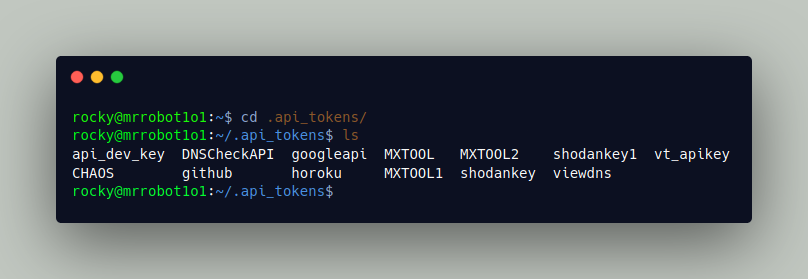
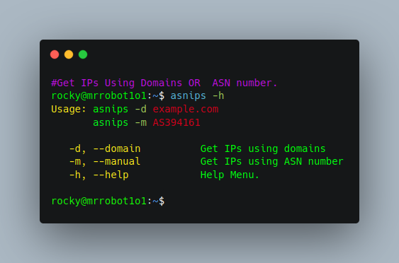

## GET All IPs of any company using ASN
<p align="left"> <a href="https://twitter.com/mrrobot1o1" target="blank"></a></p>

First Go On [Mxtoolbox](https://mxtoolbox.com) and register then grab a API key from [here](https://mxtoolbox.com/user/api) \
And **export MX_API=76193741-c335-4f56-b6hb-e5cfegbc9095** \
If You Keep Your API key in folder like me, You can add a simple if statment in .bashrc to export API keys.

```bash
if [[ -f "${HOME}/.api_tokens/MXTOOL" ]]; then
        export MX_API="$(cat ${HOME}/.api_tokens/MXTOOL1 2> /dev/null)"
fi
```

## Usage:
```bash
git clone https://github.com/mrrobot1o1/asnips.git
cd asnips
chmod +x asnips
./asnips -d tesla.com
./asnips -m AS394161
```

